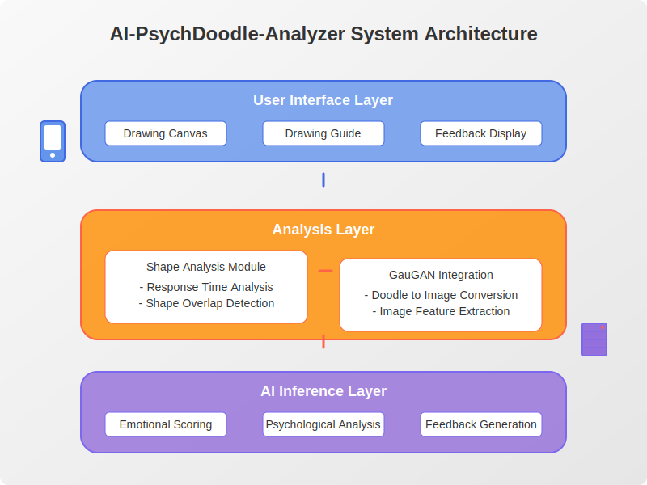

# AI-PsychDoodle-Analyzer

AI-powered psychological analysis from doodles and drawings. The application analyzes user's mental state by examining their drawings, response times, and other interactive metrics.



## Overview

AI-PsychDoodle-Analyzer is an innovative application that interprets users' psychological states through their drawings. The system provides two main analysis methods:

1. **Guided Drawing Analysis**: Users trace predefined shapes (such as triangles, circles, and squares) while the AI analyzes response time, accuracy, and drawing characteristics.

2. **Free-form Drawing Analysis**: Users create spontaneous doodles, which the AI transforms into realistic imagery using GauGAN technology, then analyzes to determine emotional states.


## Key Features

- **Shape Tracing Analysis**: Assessment of psychological state through response time, overlap accuracy, and shape characteristics
- **Free Drawing Interpretation**: GauGAN-powered transformation of doodles into meaningful imagery
- **AI-driven Psychological Insights**: Advanced analysis of drawing patterns and behaviors
- **Personalized Feedback**: Tailored recommendations based on detected emotional states

## System Architecture

The application consists of three primary components:

1. **Mobile Interface**: User-friendly drawing canvas for input collection
2. **AI Analysis Engine**: Core algorithm for drawing analysis and psychological assessment 
3. **Feedback Generator**: Custom recommendations based on analysis results



## Technical Implementation

### Drawing Analysis Process
1. The system presents original shapes to the user
2. User traces or draws shapes on the touchscreen
3. AI analyzes drawing characteristics:
   - Response time
   - Shape overlap accuracy
   - Shape completeness
   - Color selection patterns
4. Emotional scoring based on drawing metrics
5. Personalized feedback generation

### Free Drawing Analysis
1. User creates a free-form drawing/doodle
2. GauGAN model transforms the doodle into realistic imagery
3. AI analyzes image characteristics:
   - Color composition
   - Shape distribution
   - Drawing patterns
4. Emotional state assessment
5. Customized feedback delivery


## Project Structure

```
AI-PsychDoodle-Analyzer/
├── src/
│   ├── api/                  # REST API implementation
│   ├── models/               # ML models for analysis
│   │   ├── shape_analyzer/   # Shape tracing analysis
│   │   └── gaugan_adapter/   # GauGAN implementation
│   ├── utils/                # Helper functions
│   └── app/                  # Mobile app integration code
├── doc/
│   ├── images/               # Documentation images
│   ├── model_training.md     # Model training documentation
│   └── api_specs.md          # API specifications
└── deployment/
    ├── server/               # Server deployment configs
    └── mobile/               # Mobile app deployment
```

## Usage Examples

**Shape Tracing Analysis:**
```python
from src.models.shape_analyzer import ShapeAnalyzer

# Initialize the analyzer
analyzer = ShapeAnalyzer()

# Analyze a traced shape
results = analyzer.analyze(
    original_image_path="path/to/original.png",
    traced_image_path="path/to/traced.png",
    response_time=2.45  # seconds
)

# Get psychological assessment
assessment = results.get_assessment()
print(f"Emotional State: {assessment.emotional_state}")
print(f"Confidence Score: {assessment.confidence}")
```

**Free Drawing Analysis:**
```python
from src.models.gaugan_adapter import GauGANAdapter
from src.models.drawing_analyzer import DrawingAnalyzer

# Initialize models
gaugan = GauGANAdapter()
analyzer = DrawingAnalyzer()

# Generate realistic image from doodle
realistic_image = gaugan.transform(doodle_path="path/to/doodle.png")

# Analyze the generated image
assessment = analyzer.analyze_image(realistic_image)
print(f"Emotional State: {assessment.emotional_state}")
print(f"Recommended Feedback: {assessment.feedback}")
```

## Installation

1. Clone the repository:
```bash
git clone https://github.com/JJshome/AI-PsychDoodle-Analyzer.git
cd AI-PsychDoodle-Analyzer
```

2. Install dependencies:
```bash
pip install -r requirements.txt
```

3. Run the server:
```bash
python src/api/server.py
```

4. For mobile app development, see `deployment/mobile/README.md`

## License

Patent Pending

## Mobile App

Download our mobile app on Google Play:
[https://play.google.com/store/apps/details?id=com.ucaretron.app3young4](https://play.google.com/store/apps/details?id=com.ucaretron.app3young4)
